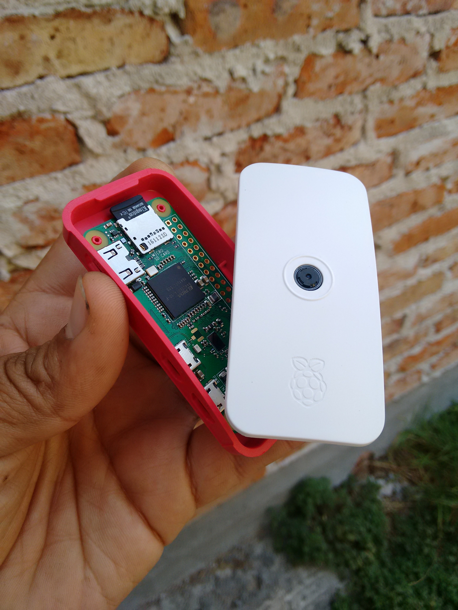

# rpi_telegram_bot
In this little proyect two topics are demonstrared: Telegram Bot usage and accessing Raspberry Pi camera from Python



Jose Federico Ramos Ortega

This code is the demonstration of the API of telegram bot via telepot library
This code is specially crafted for the Tepache Hacklab Dev Night 10, Leon Gto, 27 May

Hardware requirements:
- Raspberry Pi 3/Zero W (tested, other versions may work)
- Raspberry Pi Camera V2 (tested, V1 should work)
- USB Cable & Charguer, SD Card with Lates Raspbian Jessi Lite, and Wifi adapter (if not included in the board)

Software Requirements:
- Rasbian Jessi Lite 2017-04-10 (tested)
- pip ( sudo apt-get install python-pip )
- telepot ( sudo pip install telepot )
- MP4Box ( sudo apt-get install gpac )
- PiCamera (is installed by default in the latest Raspbian)

How to run:

python rpi_telegram_bot.py BotToken ChatID

How to get my ChatID?:

Run the script in a ssh session, you can run with 0 as chatid, when the bot are "listening", talk with him, the chatid will be
printed in the console, stop the script (ctrl+c) and restart with the correct id.

Creating and modding a bot in telegram:
https://core.telegram.org/bots

Connecting and enabling the Raspberry Pi Camera:
https://www.raspberrypi.org/learning/getting-started-with-picamera/

If you want to start the script at boot, add this to the bottom of /etc/rc.local, before exit 0 ( sudo nano /etc/rc.local )
```
cd rpi_telegram_bot
python rpi_telegram_bot.py BotToken ChatID
```
